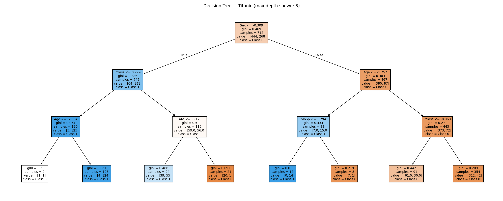
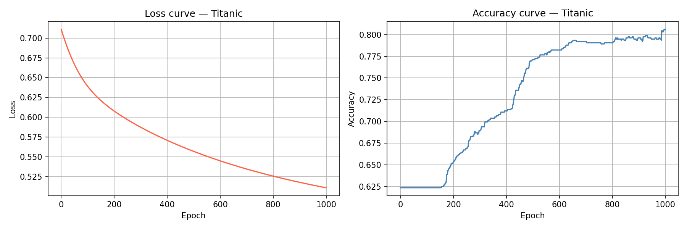
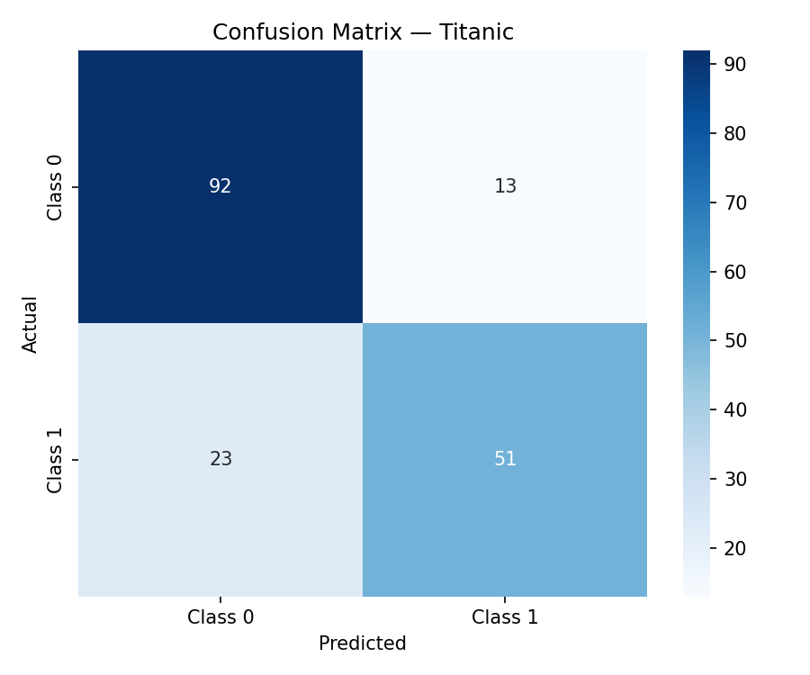
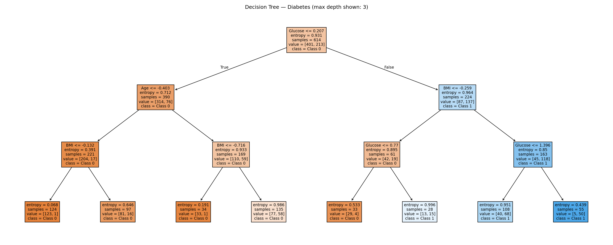
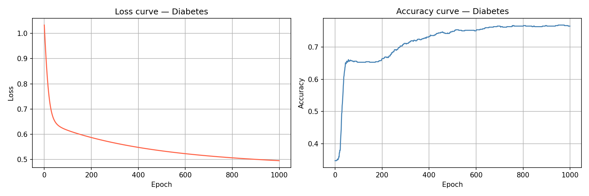
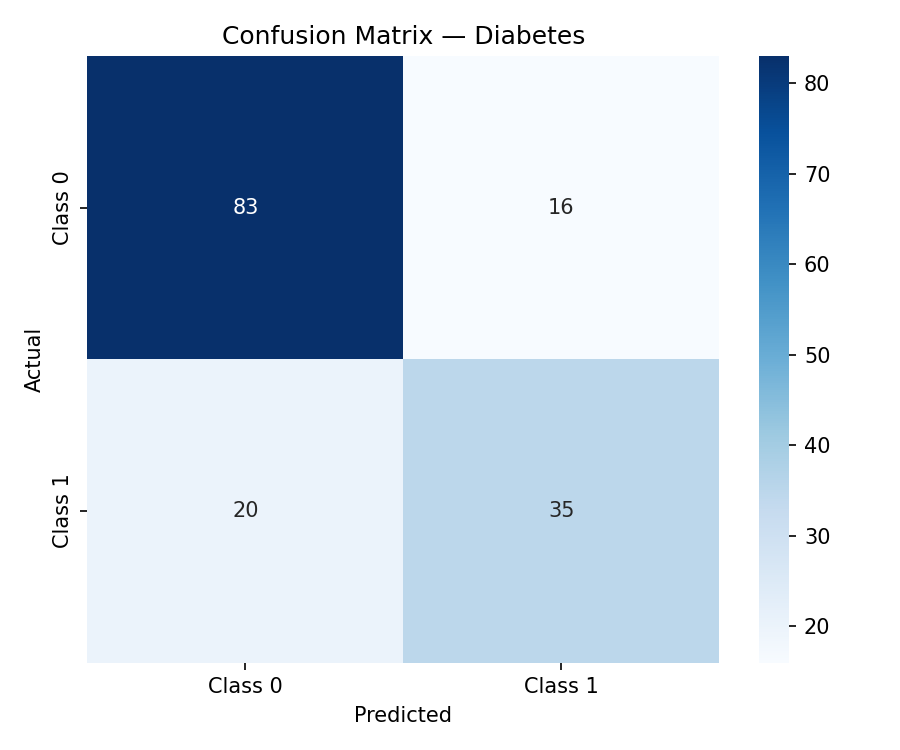

# Neural Networks vs Decision Trees: Classification Analysis

##  Project Overview

This project compares two classification approaches:

* Backpropagation Neural Network (BPN)
* Decision Tree

Both models were evaluated on two real-world datasets and benchmarked against Weka to analyze performance differences.

---

## Datasets

* Titanic Dataset
* Diabetes Dataset

---

## Methods

* Custom Backpropagation Neural Network implementation in Python
* Decision Tree classification
* Weka comparison using MultilayerPerceptron and J48

---

## Results

| Dataset  | Model                | Accuracy |
| -------- | -------------------- | -------- |
| Titanic  | Decision Tree (J48)  | 79.2%    |
| Titanic  | Neural Network (BPN) | 77.0%    |
| Diabetes | Decision Tree (J48)  | 76.0%    |
| Diabetes | Neural Network (BPN) | 74.0%    |

---

## Visual Results

### Titanic Dataset

#### Decision Tree



#### Neural Network (BPN)



#### Confusion Matrix



---

### Diabetes Dataset

#### Decision Tree



#### Neural Network (BPN)



#### Confusion Matrix




## Project Structure

```bash
data-mining-analysis/
│── datasets/
│── src/
│── results/
│── README.md
```


## Key Takeaways

* Decision Trees performed slightly better on both datasets
* Neural Networks required tuning of hidden nodes and learning rate
* Model performance depends strongly on dataset characteristics and hyperparameter selection


## Tools

* Python
* Pandas
* NumPy
* Matplotlib
* Scikit-learn
* Weka
